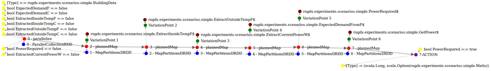
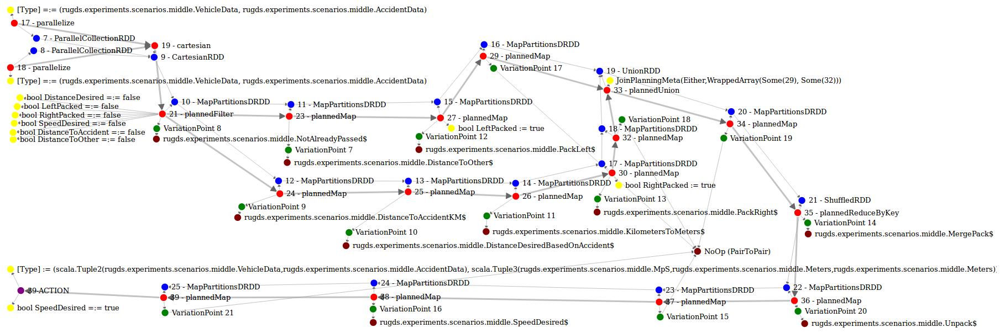
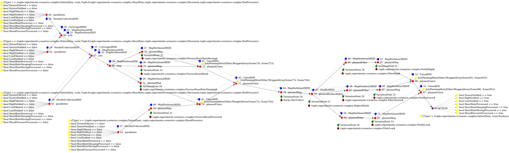

# Supplemental files for "Adaptive On-the-fly Changes in Distributed Processing Pipelines"

Supplimental experiment files for the paper "Adaptive On-the-fly Changes in Distributed Processing Pipelines". This code depends on the `dynamic-spark-core` and `dynamic-spark-planning` libraries, which are at this point not yet open source. Experiments should be compiled with the SBT Assembly plugin and submitted to a standalone Spark cluster using the scripts in `scripts/run` (see `all-experiments_cluster.sh`).

# DAG representation of the scenarios

We have also included a techincal DAG view of the pipelines that show the Spark representation, the assigned modules and the constraints set on the pipeline.

## Simple scenario

## Middle scenario

## Complex scenario

